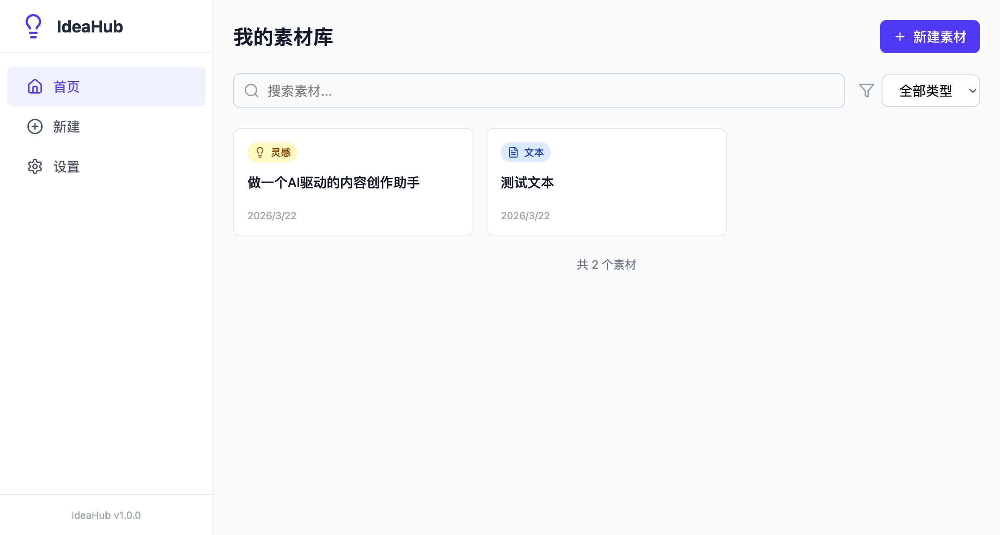
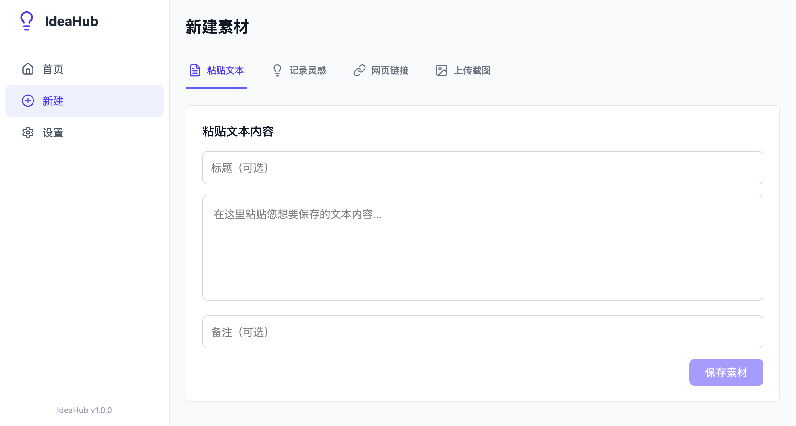
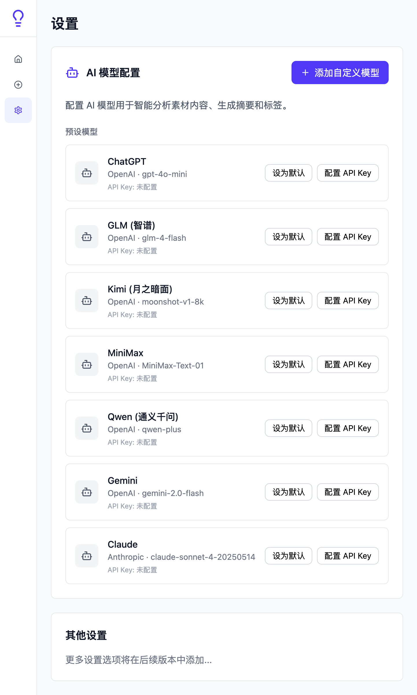

# 🎨 IdeaHub

> AI 驱动的灵感素材管理平台

IdeaHub 是一个面向内容创作者的智能素材管理工具。通过多种方式收集灵感素材，借助 AI 自动生成摘要、标签和创意建议，让你的灵感永不丢失，创作效率加倍提升。



---

## ✨ 功能特性

### 📥 多种素材输入方式
| 方式 | 说明 |
|------|------|
| 粘贴文本 | 直接粘贴任意文本内容 |
| 记录灵感 | 随时记录脑海中的灵感想法 |
| 链接解析 | 输入 URL，自动提取网页正文 |
| 截图 OCR | 上传图片，AI 识别文字内容 |

### 🤖 AI 智能加工
- **自动摘要** — 一键生成内容摘要，快速了解核心要点
- **智能标签** — AI 分析内容，自动生成分类标签
- **灵感建议** — 基于素材内容，AI 给出创作灵感和扩展方向

### 🔍 AI 语义搜索
- 采用 **Retrieve-then-Rerank** 架构，不依赖传统 RAG
- 支持自然语言查询，理解搜索意图
- 语义相关度排序，精准定位所需素材

### 🌐 多平台内容采集
集成 [MediaCrawler](https://github.com/NanmiCoder/MediaCrawler)，支持 7 大社交平台：
- 小红书 / 抖音 / 快手 / B站 / 微博 / 百度贴吧 / 知乎

### 🧠 多 AI 模型支持
| 协议 | 支持的模型 |
|------|-----------|
| OpenAI 协议 | OpenAI GPT / 智谱 GLM / Kimi / 通义千问 / MiniMax / Gemini |
| Anthropic 协议 | Claude |

支持自定义 API 端点，兼容所有 OpenAI/Anthropic 协议的服务。

### 🖼️ 双模式 OCR
- **LLM Vision 优先** — 利用大模型视觉能力进行 OCR
- **PaddleOCR 降级** — 无 Vision 模型时自动降级到本地 OCR

### 🎯 孟菲斯风格 UI
- 粗边框 + 撞色配色
- 几何图形装饰
- 流畅动效交互

---

## 📸 界面预览

<table>
  <tr>
    <td></td>
    <td></td>
  </tr>
  <tr>
    <td align="center">首页</td>
    <td align="center">创建素材</td>
  </tr>
  <tr>
    <td></td>
    <td></td>
  </tr>
  <tr>
    <td align="center">素材详情</td>
    <td align="center">设置页面</td>
  </tr>
</table>

---

## 🏗️ 技术架构

```
┌─────────────────────────────────────┐
│         IdeaHub Frontend            │
│   React 18 + Vite 5 + TailwindCSS 4 │
└──────────────┬──────────────────────┘
               │ HTTP / WebSocket
┌──────────────▼──────────────────────┐
│          IdeaHub Backend            │
│     FastAPI + SQLAlchemy 2.0        │
├─────────────┬───────────────────────┤
│  SQLite DB  │   AI Provider Layer   │
│  (aiosqlite)│  (OpenAI/Anthropic/…) │
└─────────────┴───────────┬───────────┘
                          │ HTTP API
              ┌───────────▼───────────┐
              │     MediaCrawler      │
              │    (独立开源项目)      │
              └───────────────────────┘
```

### 技术栈详情

| 层级 | 技术 |
|------|------|
| 后端 | Python 3.11+ / FastAPI / SQLAlchemy 2.0 / aiosqlite / SQLite |
| 前端 | React 18 / Vite 5 / TypeScript / TailwindCSS 4 / framer-motion |
| AI | 多提供商适配层（OpenAI 协议 + Anthropic 协议）|
| OCR | PaddleOCR / LLM Vision |
| 采集 | MediaCrawler |
| 包管理 | uv (Python) / npm (Node.js) |

---

## 🚀 快速开始

### 环境要求

- Python 3.11+
- Node.js 18+
- [uv](https://docs.astral.sh/uv/) (Python 包管理器)
- Git

### 步骤 1: 克隆项目

```bash
git clone https://github.com/YOUR_USERNAME/ideahub.git
cd ideahub
```

### 步骤 2: 安装后端依赖

```bash
cd ideahub_app
uv sync
```

### 步骤 3: 配置环境变量

```bash
cp .env.example .env
# 编辑 .env，配置相关参数（也可在启动后通过设置页配置 AI 模型）
```

### 步骤 4: 启动后端

```bash
uv run uvicorn backend.main:app --reload --port 8000
```

### 步骤 5: 安装前端依赖并启动

```bash
cd frontend
npm install
npm run dev
```

### 步骤 6: 访问应用

| 服务 | 地址 |
|------|------|
| 前端 | http://localhost:5173 |
| 后端 API 文档 | http://localhost:8000/docs |

---

## 🕷️ MediaCrawler 集成说明

IdeaHub 内置了 [MediaCrawler](https://github.com/NanmiCoder/MediaCrawler) 作为社交平台内容采集引擎。

> MediaCrawler 是一个优秀的开源项目，由 **程序员阿江 (Relakkes)** 开发维护。

### 支持的平台

| 平台 | 状态 |
|------|------|
| 小红书 | ✅ |
| 抖音 | ✅ |
| 快手 | ✅ |
| B站 | ✅ |
| 微博 | ✅ |
| 百度贴吧 | ✅ |
| 知乎 | ✅ |

### 使用流程

1. **初始化环境** — 首次使用需在采集页面点击「初始化环境」，自动安装依赖和浏览器
2. **启动服务** — 在采集页面启动 MediaCrawler 服务
3. **配置采集** — 选择平台、输入关键词、设置采集参数
4. **扫码登录** — 扫码登录对应社交平台
5. **导入素材** — 采集完成后，一键导入数据到素材库

采集的数据以 JSONL 格式存储在 `crawler_data/` 目录。

---

## ⚙️ AI 模型配置

在设置页面可以配置多个 AI 模型：

### 预设模型

系统预设了以下常见模型，只需填入 API Key 即可使用：

- OpenAI GPT-4o / GPT-4o-mini
- Anthropic Claude
- 智谱 GLM-4
- Moonshot Kimi
- 阿里 通义千问
- MiniMax
- Google Gemini

### 自定义模型

支持添加任意兼容 OpenAI 或 Anthropic 协议的模型：

1. 点击「添加自定义模型」
2. 填写 Base URL、模型名称、API Key
3. 选择协议类型（OpenAI / Anthropic）
4. 保存并测试连接

---

## 📁 项目结构

```
ideahub/
├── ideahub_app/                 # 主应用
│   ├── backend/                 # Python FastAPI 后端
│   │   ├── api/                 # API 路由
│   │   ├── database/            # 数据库模型
│   │   ├── schemas/             # Pydantic 数据验证
│   │   └── services/            # 业务逻辑
│   │       └── ai/              # AI 提供商适配层
│   ├── frontend/                # React 前端
│   │   └── src/
│   │       ├── components/      # 可复用组件
│   │       ├── pages/           # 页面组件
│   │       ├── services/        # API 调用
│   │       └── types/           # TypeScript 类型
│   ├── crawler_data/            # 采集数据目录
│   ├── .env.example             # 环境变量示例
│   └── pyproject.toml           # Python 项目配置
└── MediaCrawler/                # 社交平台采集引擎（子模块）
```

---

## 🙏 致谢

特别感谢以下开源项目：

- **[MediaCrawler](https://github.com/NanmiCoder/MediaCrawler)** — 由程序员阿江 (Relakkes) 开发的优秀社交平台爬虫项目，为 IdeaHub 提供了强大的多平台内容采集能力
- **[FastAPI](https://fastapi.tiangolo.com/)** — 现代、高性能的 Python Web 框架
- **[React](https://react.dev/)** — 用于构建用户界面的 JavaScript 库
- **[PaddleOCR](https://github.com/PaddlePaddle/PaddleOCR)** — 百度开源的 OCR 工具库

---

## 📄 许可证

本项目基于 [MIT License](LICENSE) 开源。

> **注意**：MediaCrawler 使用其自己的许可证，详见 [MediaCrawler License](MediaCrawler/LICENSE)。

---

## 🤝 贡献指南

欢迎参与贡献！

1. Fork 本仓库
2. 创建特性分支 (`git checkout -b feature/AmazingFeature`)
3. 提交更改 (`git commit -m 'Add some AmazingFeature'`)
4. 推送到分支 (`git push origin feature/AmazingFeature`)
5. 提交 Pull Request

如有问题或建议，欢迎 [提交 Issue](https://github.com/YOUR_USERNAME/ideahub/issues)。

---

<p align="center">
  如果这个项目对你有帮助，欢迎 ⭐ Star 支持！
</p>
